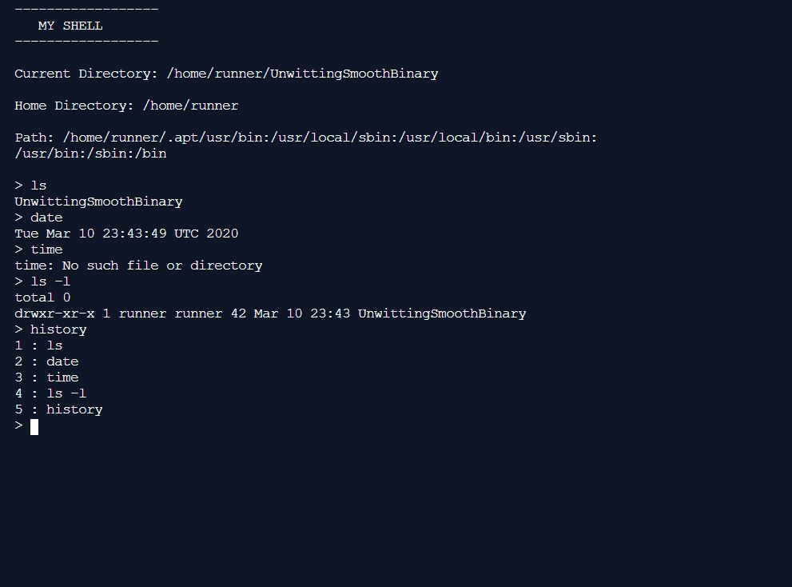

# SHELL

A C program for a simple shell, to excute some internal and external commands such as ls, cd, setpath, getpath, alias etc.

## Other features
Persistent History (saves and reloads history).
Persistent Alias (saves and reloads alias).
Aliasing an alias and removing alias.

## Shell Picture

